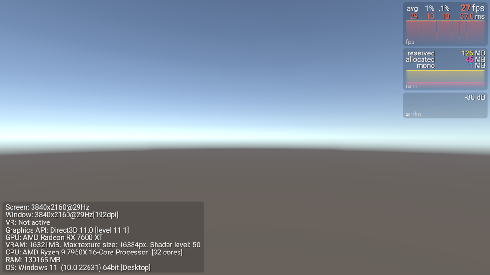

# GraphyTest

A test framework for generating framerate spikes

This project contains a single scene file. You should Build and Run to test so that Unity waits for vsync.

To configure the spikes, edit the `Spike` script on the `Camera`. For each spike you can set the period in seconds, the delay until the first spike in seconds, and the spike duration in milliseconds. You can set as many spikes as you like.

